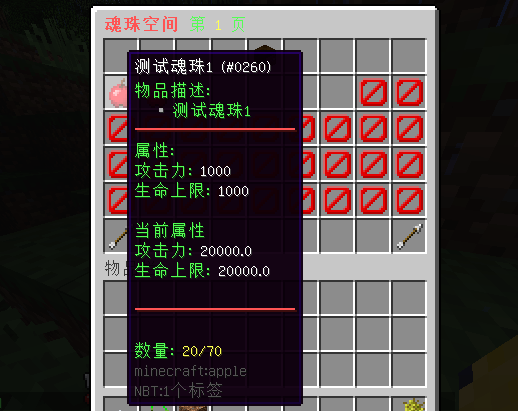
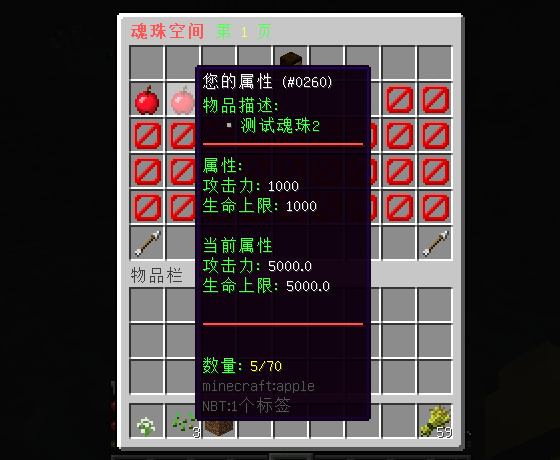
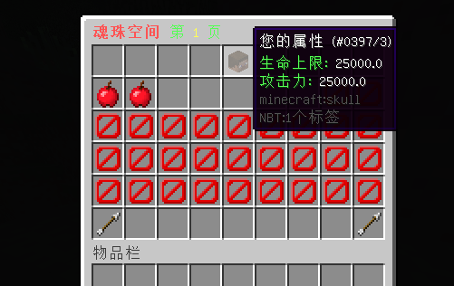
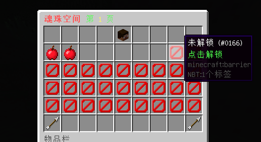
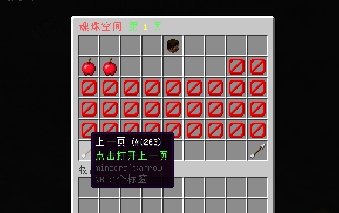
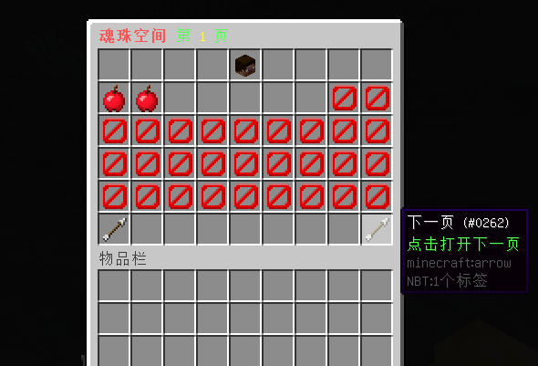

# 魂珠空间 - HZRing

#### 适用版本

- 1.12.2

#### 依赖插件
- SimpleLib
- MythicMobs

#### 存储方式：

- 支持支持SQLite、MySQL数据存储方式。

#### 属性兼容：

- 兼容SX-Attribute、AttributePlus和ItemLoreOrigin三款主流属性插件。

#### GUI 功能：

- 槽位解锁：支持通过 GUI 界面解锁不同槽位，方便玩家管理和使用魂珠。
- GUI翻页：提供GUI界面翻页功能，每页最多可以放入 36 种魂珠。
- 权限设置：每种魂珠可以设置不同的权限，以控制玩家可以放入的魂珠数量。

#### 属性显示：

- 单个魂珠属性：可以显示单个魂珠的属性，方便玩家了解每个魂珠的属性。
- 当前数量魂珠属性：显示当前拥有数量的魂珠属性，实时了解当前魂珠带来的属性加成。
- 所有魂珠总计属性：显示玩家所有魂珠的总计属性，直观地看到自己所拥有的全部魂珠属性。

#### 魂珠演示：

#### 属性统计：

#### 槽位解锁：

#### GUI翻页：

