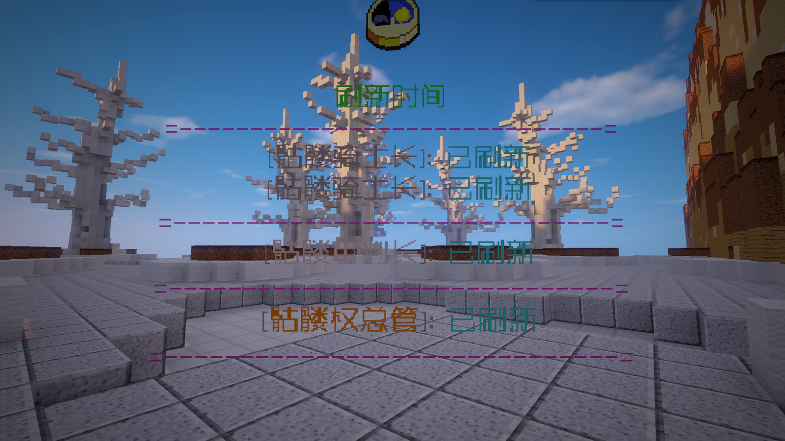

# 刷新点倒计时 - MMShow

#### 适用版本

- 1.12.2

#### 依赖插件

必要:

- SimpleLib
- MythicMobs

#### 刷新点类型：

- 插件支持从MythicMobs的怪物刷新点中读取Cooldown和Warmup的倒计时信息。

#### 变量支持：

- 插件使用变量来显示倒计时，这意味着你可以在任何支持变量的地方（如聊天消息、菜单、血条公告等）展示这些倒计时。

#### 多种时间单位：

- MMShow支持以秒、分、时为单位显示倒计时，使得玩家可以更加直观地了解剩余时间。

#### 插件变量：

| 内容          | 变量                           |
|-------------|------------------------------|
| Cooldown倒计时 | %mmshow_cooldown_怪物生成点_单位类型% |
| Warmup倒计时   | %mmshow_warmup_怪物生成点_单位类型%   |

#### 效果展示：

