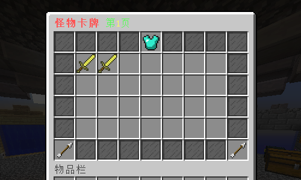
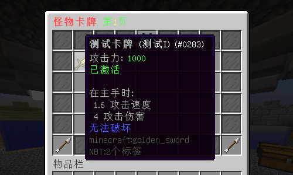
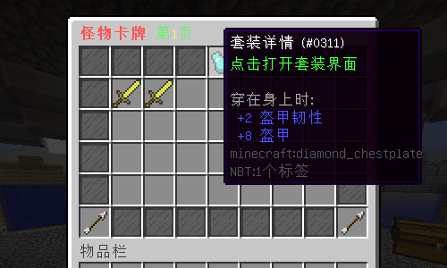
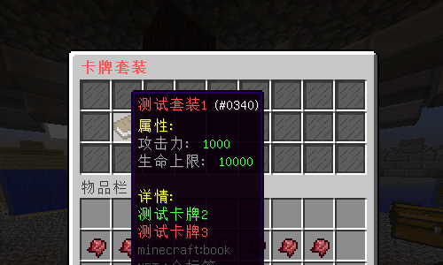

# 怪物卡牌 - MonsterCard

#### 适用版本
- 1.12.2
#### 依赖插件
必要:
- SimpleLib
- MythicMobs
#### 存储方式：
- 支持支持YAML、MySQL数据存储方式。
#### 获取卡牌：
- 玩家可以通过 MythicMobs 物品给予指令获得卡牌，获取后手持右键即可激活卡牌。
#### 属性效果：
- 卡牌属性根据 MythicMobs 物品的 Lore 生效，使得每张卡牌都具有独特的属性和效果。
#### 卡牌激活：
- 激活的卡牌可以在插件的GUI中查看，可以随时了解已经激活的卡牌。
#### 卡牌套装：
- 插件支持卡牌套装功能，玩家可以收集和激活特定的卡牌套装，获得额外的属性加成。
#### 卡牌演示：

#### 卡牌套装：

