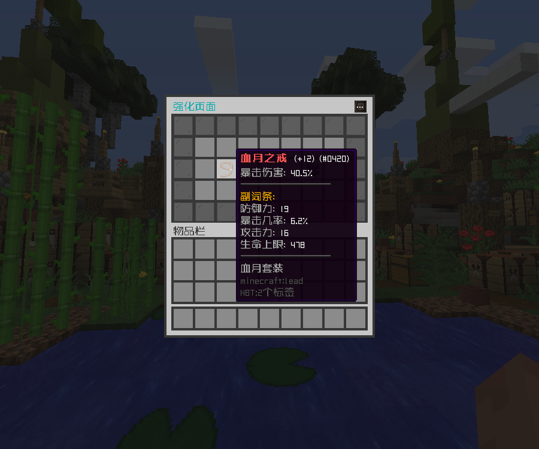
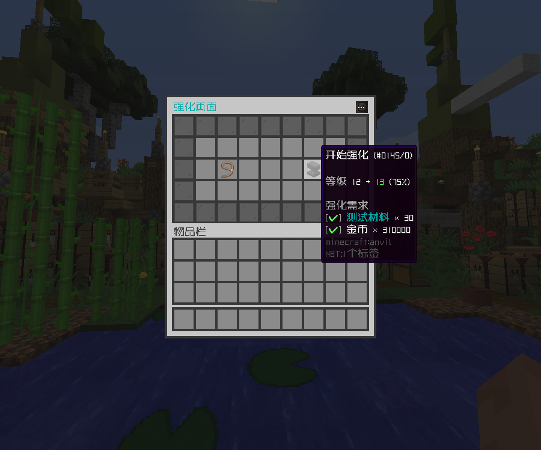

# 仿原神强化

## 功能介绍

基于物品处理模块，可鉴定随机主词条与不同数量的副词条。每次升级主词条递增，每 4 级随机新增或强化副词条。词条数值分
4 档随机提升，消耗材料与成功率随等级变化。

## 物品鉴定

使用指令获取物品，获取时会进行 **表达式解析** 与 **变量处理**。

```
/cxi give <玩家> <物品库> <物品> <变量库> <数量> 

```

示例

```
/cxi give Yeezhi mm 血月之戒 词条库 1 

```

## 效果展示




## 配置文件

::: code-group

<<< config/功能配置.yml{yaml}
<<< config/变量配置.yml{yaml}
<<< config/物品配置.yml{yaml}

:::

