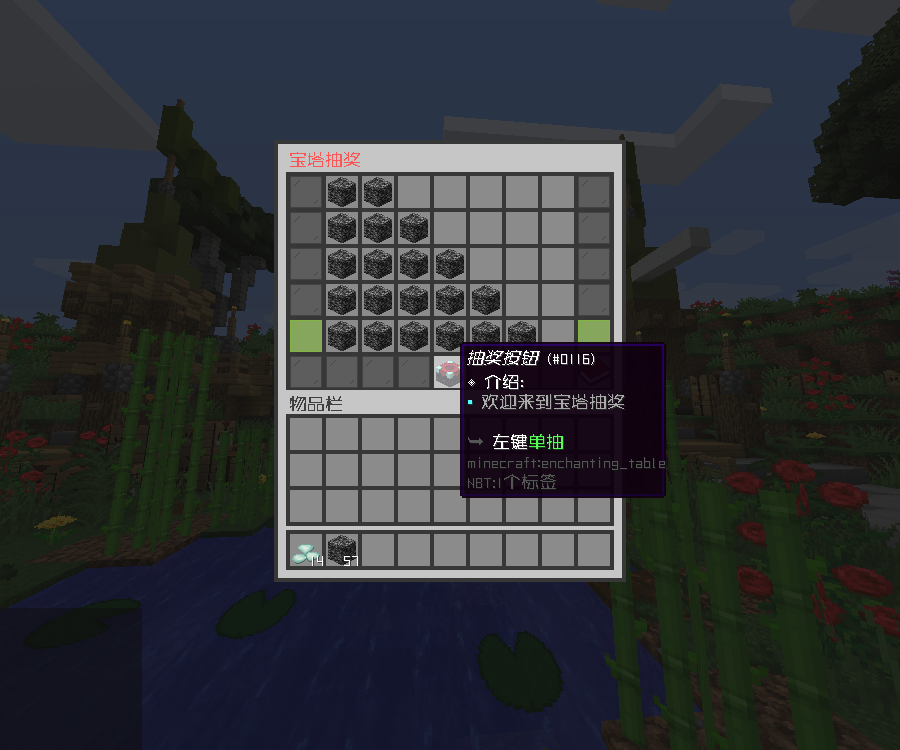
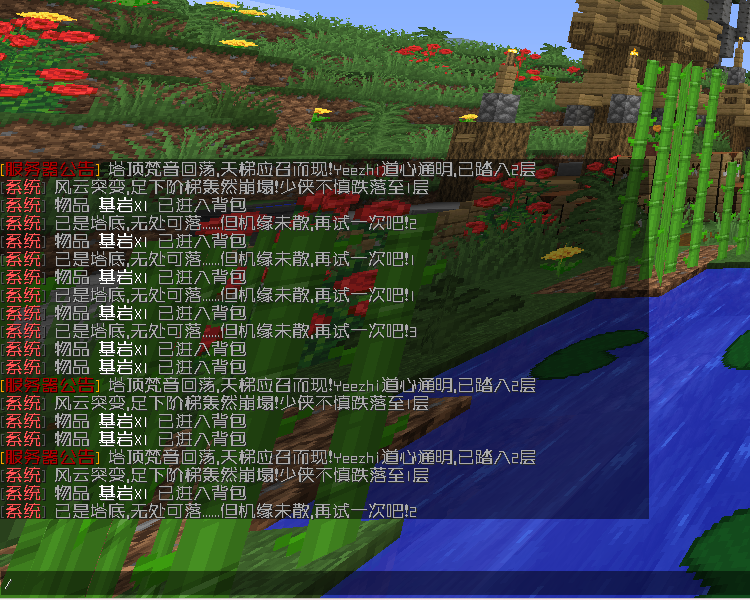

# 宝塔抽奖

配置由用户 1176434518 提供

## 功能介绍

当前层数由绿色玻璃板标识。每次抽奖会从对应层级中随机选取一个奖品：抽中最右侧物品可晋升一层，抽中其他物品则会掉落一层；若抽中最终奖品，则直接回到第一层

## 效果展示

## 配置文件

::: code-group

<<< config/功能配置.yml{yaml}
<<< config/变量配置.yml{yaml}

:::

