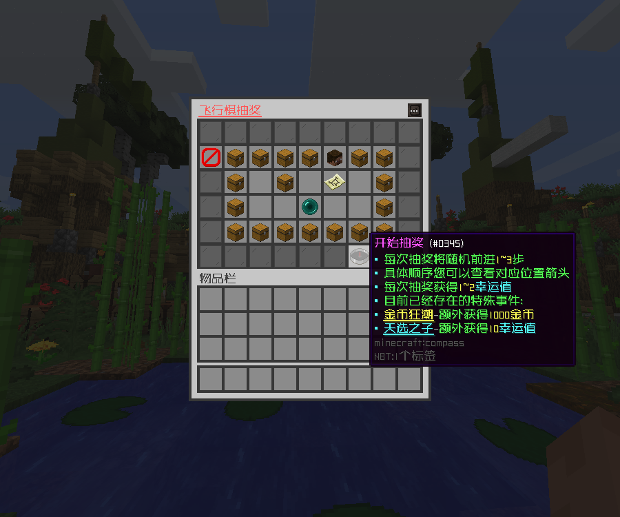
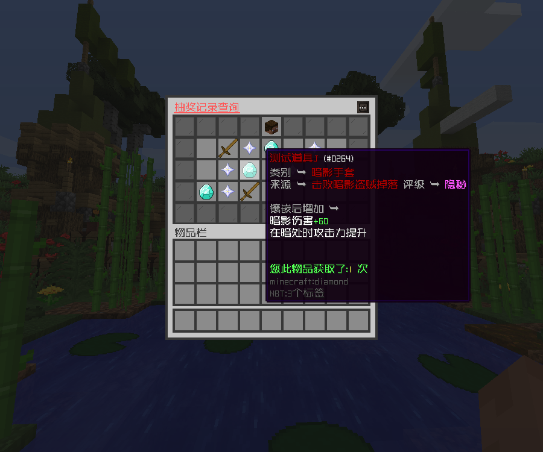

# 飞行棋抽奖

配置由用户 3012235075 提供

## 功能介绍

玩家从起点出发，通过消耗材料或点数点击前进 1~3 步（可配置），到达对应槽位后可领取奖励，记录将保存至抽奖历史
GUI。支持手动重置、查看记录、使用幸运值获取保底奖励。

飞行棋可配置特殊事件，如回退、重置、增加幸运值或执行动作。管理员可操作幸运值、当前位置、点数与轮次记录，并使用 cx look
查看玩家抽奖数据。

## 效果展示

## 配置文件

::: code-group

<<< config/飞行棋抽奖.yml{yaml}
<<< config/抽奖记录查询.yml{yaml}
<<< config/变量配置.yml{yaml}
<<< config/物品配置.yml{yaml}

:::

