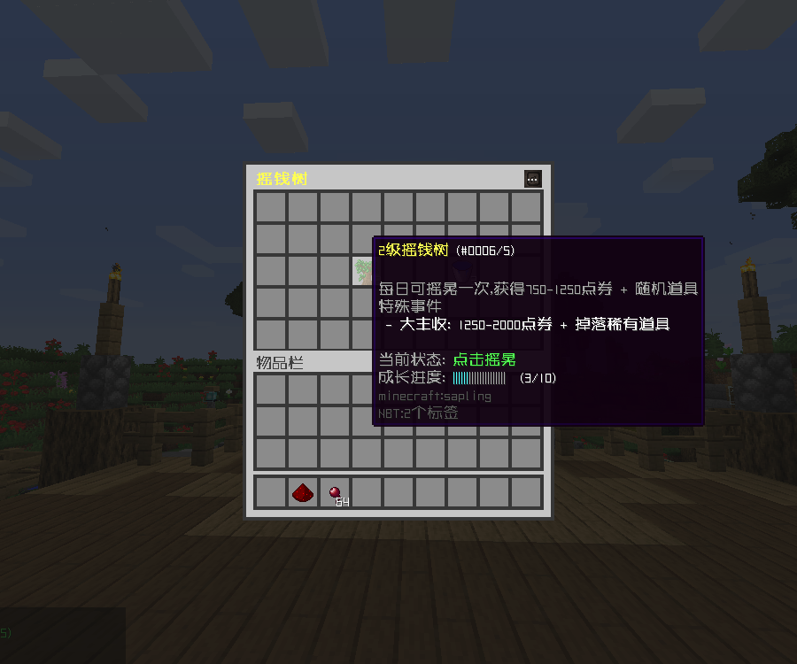

# 摇钱树

### 🌳 简介

摇钱树是一种每日可互动的树木，玩家可以 **摆晃树干** 获取奖励，并通过 **浇水** 提升树木等级，获得更丰厚的收益。树木每天刷新，为玩家带来全新的养成体验！

## 🎮 摇钱树互动

### 🌿 摆晃树干

- 玩家 **每日可摆晃一次**，获得 **点券 + 随机道具**。
- 有一定概率触发 **特殊事件**：
    - **🌟 大丰收**：掉落 **稀有道具**。

### 💧 浇水升级

- 玩家可 **消耗点券** 进行 **浇水**，促进摇钱树成长。
- 每个等级需要 **不同次数的浇水** 才能升级：
    - **Lv.1 → Lv.2**：5 次浇水
    - **Lv.2 → Lv.3**：10 次浇水

- 有一定概率触发 **特殊事件**：
  - **🌱 快速生长**：额外增加**成长进度**。
  - **💧 免费浇水**：**免费浇水**。
  - **🦀 枯萎**：当前等级的 **成长进度清零**，但 **不会降级**。

## 🎁 奖励机制

### 💰 点券掉落计算

普通 = **(随机倍率 0.75 - 1.25) × 每次浇水消耗点券**    
大丰收 = **(随机倍率 1.25 - 2.00) × 每次浇水消耗点券**

**示例**：

- **浇水消耗** 500 点券
- 随机倍率 **0.8** → **掉落 400 点券**
- 随机倍率 **1.2** → **掉落 600 点券**

### **📚 各等级掉落**

| **等级**   | **点券奖励**   | **额外奖励**     |  
|----------|------------|--------------|  
| **Lv.1** | **基础点券掉落** | **随机 1 级道具** |  
| **Lv.2** | **更多点券掉落** | **随机 2 级道具** |  
| **Lv.3** | **大量点券掉落** | **随机 3 级道具** |  
| **Lv.4** | **大量点券掉落** | **随机 4 级道具** |  

### 效果展示

### 配置文件

::: code-group

<<< config/功能配置.yml{yaml}
<<< config/变量配置.yml{yaml}

:::

