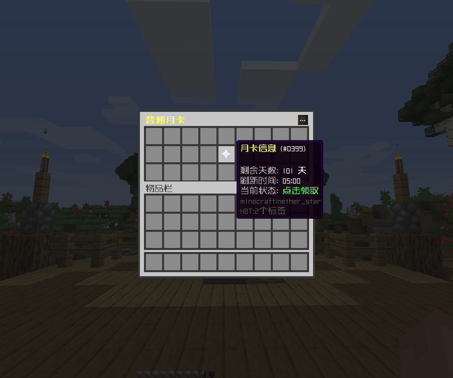
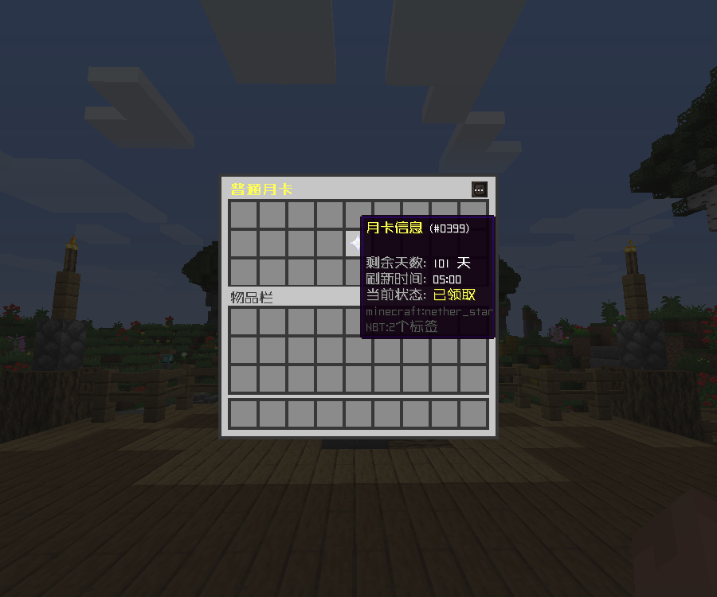

# 月卡

### 功能介绍

默认配置会在每日 05:00 刷新月卡，玩家每天可领取 300 点券。

请在 `CraftX\function\月卡.yml` 文件中根据需要自行配置月卡信息

**指令：**

```
/var add 月卡 <玩家名> <天数>
```

**示例：**

```
/var add 月卡 Yeezhi 30
```

此指令将为指定玩家增加月卡天数，且在未登录期间，月卡领取次数将不会消耗。

### 效果展示




### 配置文件

::: code-group

<<< config/功能配置.yml{yaml}
<<< config/变量配置.yml{yaml}

:::

