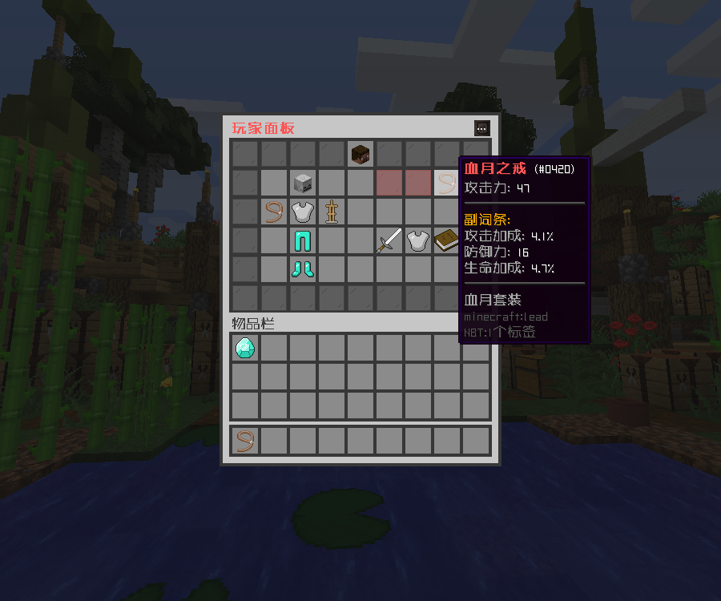
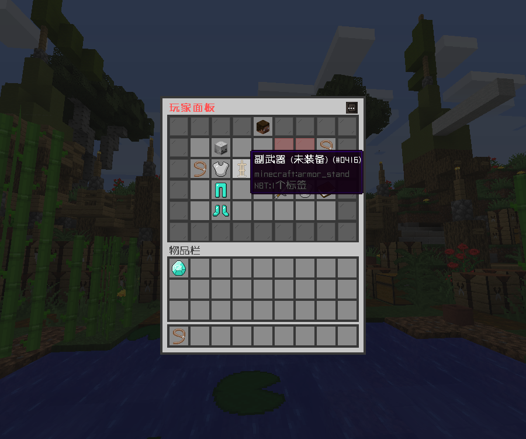
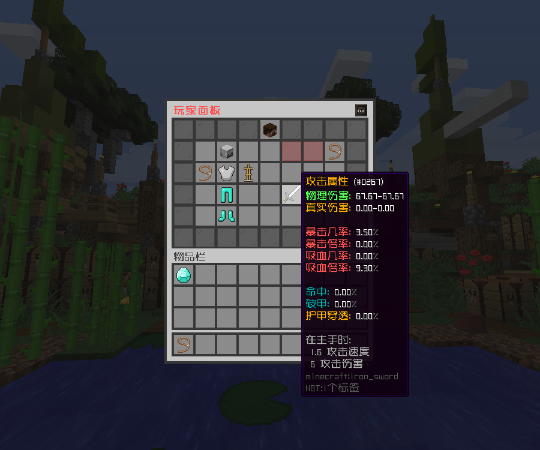

# 玩家面板

配置由用户 2932102935 提供

## 功能介绍

基于无尽工艺 GUI，显示目标玩家的背包、龙核、萌芽、饰品槽位及相关变量数据的玩家面板。可用于管理员查看玩家信息，或供玩家之间互相查看

## 槽位适配

- ✅龙核 DragonCore
- ✅萌芽 GermPlugin
- ✅饰品 YeeJewelry
- ✅饰品 LyInventory

## 使用说明

**指令：**

```
/cx look 玩家面板 <目标玩家>
```

此指令默认需 OP 权限，可配合其他插件（如玩家交互执行 OP 指令）以允许玩家查看目标玩家的面板信息

## 效果展示





## 配置文件

::: code-group

<<< config/功能配置.yml{yaml}
:::

