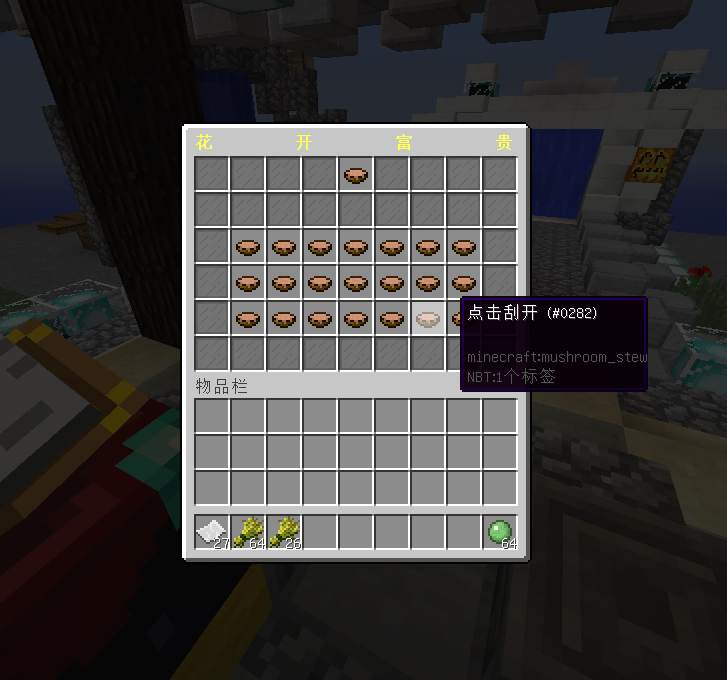

# 刮刮乐 - ScratchCard - 44R

#### ℹ️适用版本

- 1.9-1.21

#### 🔧插件功能：

- 支持 JSON / MySQL 存储 📁🔍
- 玩家刮出号码，与预设中奖号码匹配则获得奖励。
- 每个奖励有次数统计，抽中时会重置统计。
- 引入保底机制，确保多次未中奖后可获得特定奖励。
- 支持添加自定义物品作为奖励。
- 支持多种物品库，包括 MythicMobs、SX-Attribute、NeigeItems 和 OriginAttribute
- 支持 Vault 和 PlayerPoints 货币系统。

#### 🎬使用视频

[ScratchCard 使用视频](https://www.bilibili.com/video/BV1XN411L7iQ/?share_source=copy_web&vd_source=92b2fd908671149c91aa9aa2d1163754)

#### 🎉效果展示

