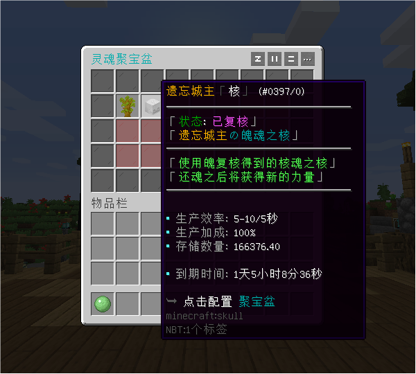

# 聚宝盆 - SpaceGoldmine - 88R

### 一款纯氪的插件，让玩家花钱挂机、离线挂机，材料数值化

#### ℹ️适用版本

- 1.9-1.21

#### 🔧插件功能：

- 支持 JSON / MySQL 存储 📁🔍
- 供玩家的充值项目有生产槽位，生产加成，离线生产的时效
- 支持生产加成时加速扣除聚宝盆时效和离线生产的倍率配置
- 支持生产和存储物品允许设置小数点数量（如0.35个物品）
- 内置无限存储且支持小数的库存仓库
- 可根据物品Lore或Name甚至是MM物品匹配生产方案
- 生产方案支持YeeCore条件表达式，极大丰富了插件的扩展性
- 支持将带有特定Lore或Name的物品设置为黑名单，禁止这些物品用于生产

#### 🎉效果展示

