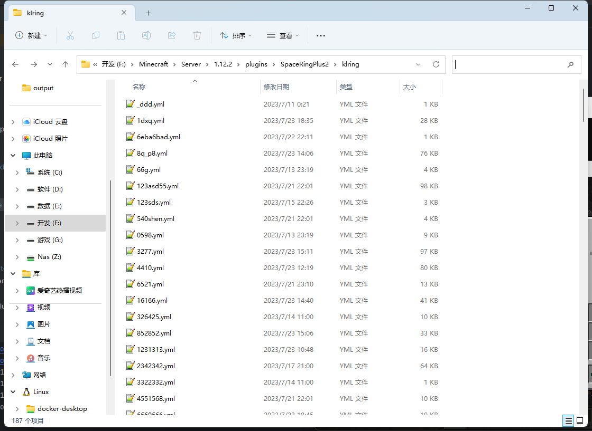

# KLRing迁移

:::danger 警告
请在测试服实操确保没问题并备份好数据再在主服进行操作
:::

### **数据迁移**

要更换SpaceRingPlus，请执行以下步骤：

1. 服务器开启维护模式或临时暂停使用KLRing
2. 下载并配置好本插件
3. 插件配置文件目录下创建`klring`目录，路径为`plugins/SpaceRingPlus2/klring`
4. 将`plugins/KLRing/data/soul-space`目录下的所有文件复制到`plugins/SpaceRingPlus2/klring`(效果如下图所示)

完成以上操作玩家进服时数据会自动导入

