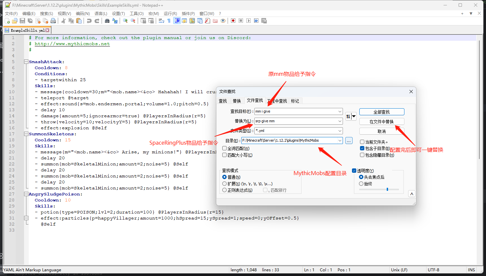

# 掉落物配置

:::danger 警告
替换前请先备份MythicMobs所有配置文件
:::

### **配置替换**

需要让怪物掉落物自动进入灵魂空间，请执行以下步骤：

1. 打开Notepad++
2. 使用Notepad++将路径`plugins\MythicMobs`下的配置内容`mm i give`全部替换为`srg give mm`(效果如下图所示)

完成以上操作，玩家拥有灵魂空间戒指并打开拾取模式物品会自动进入灵魂空间

