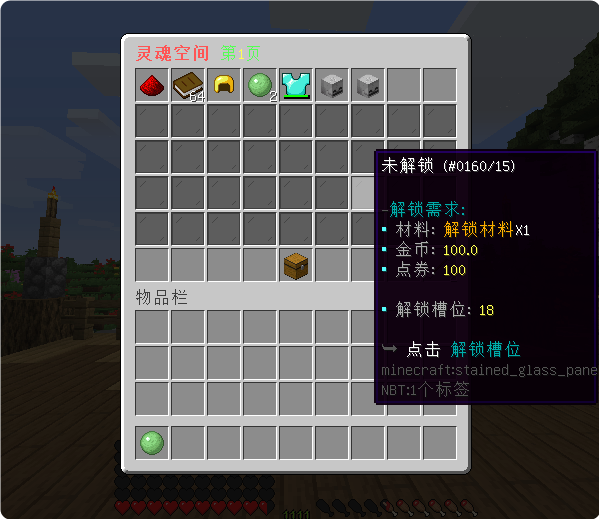
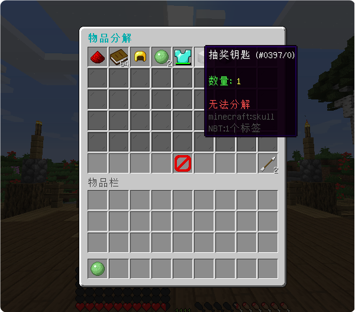
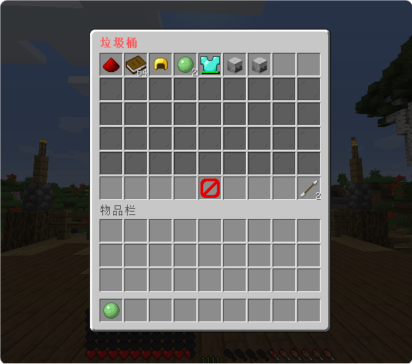

# 灵魂空间 - SpaceRingPlus - 88R

#### ℹ️适用版本

- 1.9-1.21

#### 💪插件优势：

- 仓库物品堆叠无上限，适用秒刷等玩家拥有大量材料物品的RPG服
- 自动拾取怪物掉落物进入仓库，还可搭配兑换附属快速消耗材料

#### 🔧插件功能：

- 支持 JSON / SQLite / MySQL 存储 📁🔍
- 仓库物品槽位可无限堆叠，每页容量上限45格
- 支持自动拾取怪物掉落物和地上掉落物进仓库
- 支持将 MM、SX、NI、OA 等物品给予至仓库
- 插件自带垃圾桶和快捷分解功能，方便玩家快捷操作物品。
- 支持拥有不同权限节点玩家享受不同的物品掉落倍率
- 可独立配置每页解锁方案(默认容量,解锁材料,解锁货币,堆叠上限)
- 仓库最大支持54页，可根据权限为每个玩家设定最大的仓库页数
- 支持设置带有特定Lore或Name的物品为黑名单，禁止这些物品被放入仓库

#### 🚀KLRing迁移：

- 支持完整导入KLRing插件的玩家数据

#### 💾数据备份：

- 支持定时或手动进行数据备份和数据导入功能，确保玩家数据的安全性和可迁移性。

#### 🛠️附属介绍：

1. [限时倍率 - SpaceRingItem](https://docs.qq.com/aio/DQmFtTmJvclhBWklH?p=gBYy0ZAJqoB3APhDTqcmzz)
   简介：支持使用指令给予玩家时长不等的给予倍率，类似限时会员
1. [灵魂兑换 - SpaceRingExchange](https://docs.qq.com/aio/DQmFtTmJvclhBWklH?p=XJ6pJqqj8pfyJKR2BeJAL0)
   简介：支持同时消耗背包和仓库内物品进行快捷兑换
1. [灵魂商店 - SpaceRingShop - 77R](https://docs.qq.com/aio/DQmFtTmJvclhBWklH?p=pkvhoauxSwAaWSP2EkLfZs)
   简介：支持背包+仓库物品交易，货币交易，商品限购，权限要求，出售与收购等多种条件的快捷商店插件

#### 💰插件套餐：

- 标准版：88元 仅插件本体
- 豪华版：158元 额外(快捷兑换，限时倍率，快捷商店)

#### 🎉效果展示

