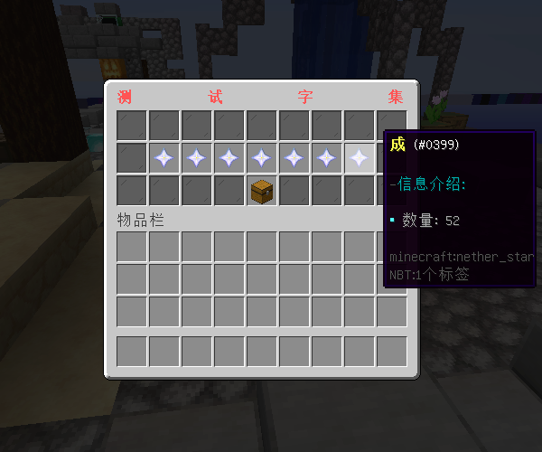
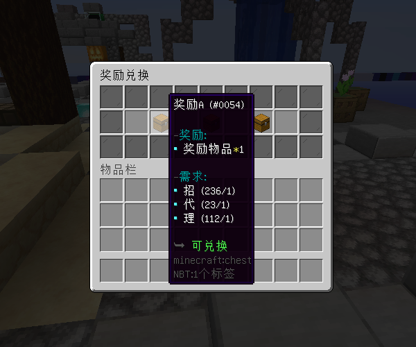
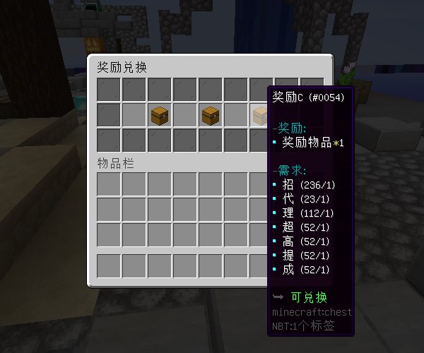

# 集字 - YeeCollect - 44R

#### ℹ️适用版本

- 1.9-1.21

#### 🔧插件介绍

- 支持 JSON / MySQL 存储📁🔍
- 服主可为限时活动或节日庆典配置独特的集字活动方案
- 支持与任务系统、怪物掉落、地图探索等插件协同使用，玩家可通过多种方式收集字符
- 可通过指令给予玩家字符，或将字符绑定到MythicMobs物品，玩家右键物品即可获得字符
- 支持多种奖励方案，部分字符可兑换普通奖励，集齐全部字符可兑换豪华奖励

#### 🎬使用视频

[YeeCollect 使用视频](https://www.bilibili.com/video/BV1J4gCe6E4J/?share_source=copy_web&vd_source=92b2fd908671149c91aa9aa2d1163754)

#### 🎉效果展示

#### 奖励兑换

