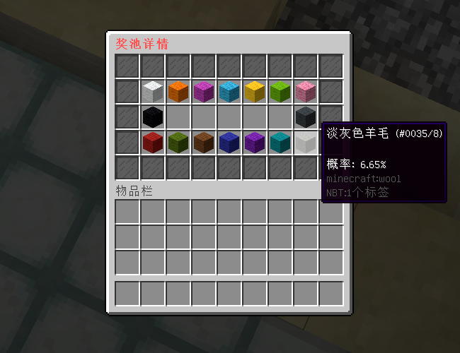
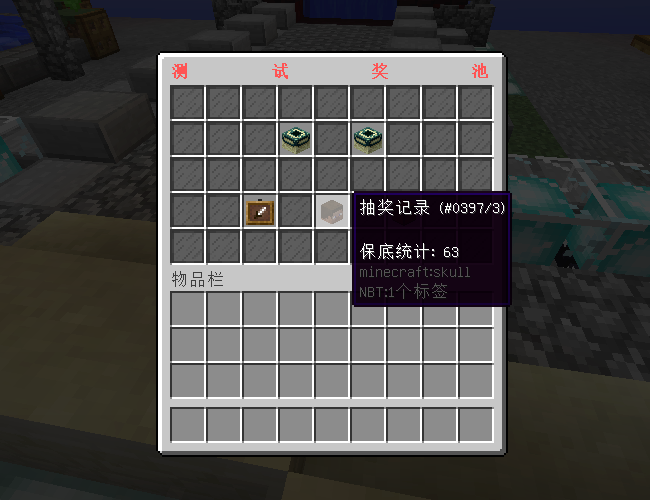
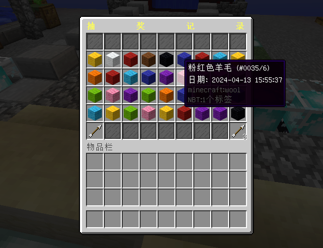
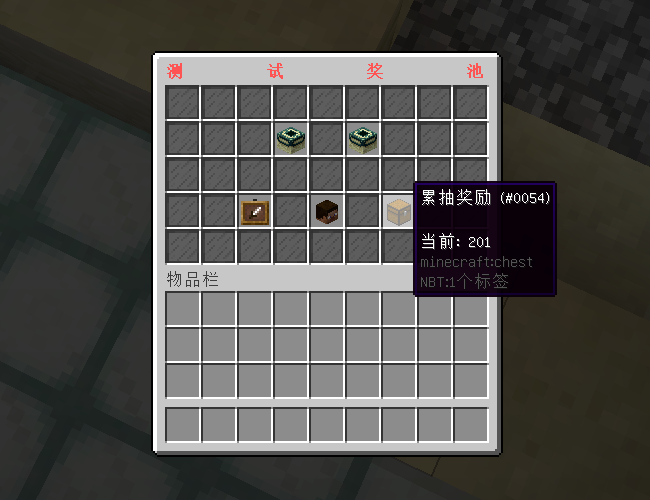
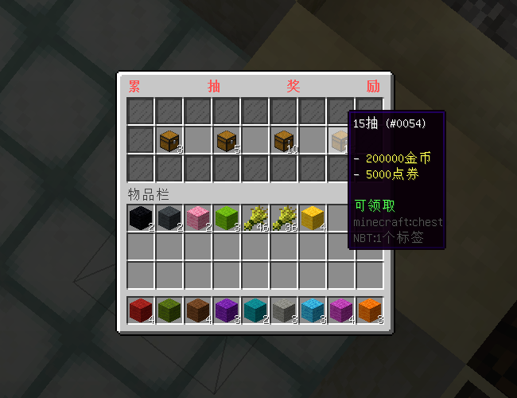

# 抽奖 - YeeCrate - 66R

#### ℹ️适用版本

- 1.9-1.21

#### 🔧插件功能：

- 支持 JSON / MySQL 存储 📁🔍
- 支持多个奖池，每个奖池包含不同的奖励物品和抽奖条件。
- 提供多个GUI配置方案，便于切换或满足不同奖池需求。
- 具备保底机制，确保玩家多次未中奖后可获得特定奖励。
- 玩家进行多次抽奖后可获得额外奖励。
- 玩家可查看抽奖记录，包括物品和时间。
- 支持单次或多次抽奖，灵活选择。
- 配置奖池物品的抽取权重，控制中奖概率。
- 显示奖池物品的预览概率，并支持虚假概率增加悬念。

#### 🎬使用视频

[YeeCrate 使用视频](https://www.bilibili.com/video/BV1w1421C7SP/?share_source=copy_web&vd_source=92b2fd908671149c91aa9aa2d1163754)

#### 🎉效果展示

