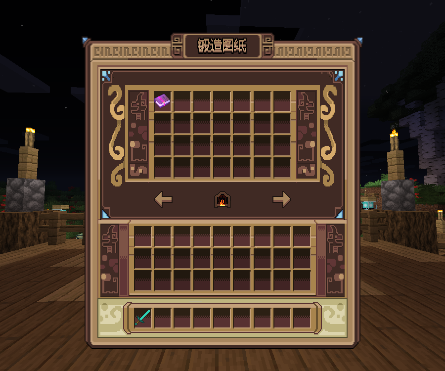
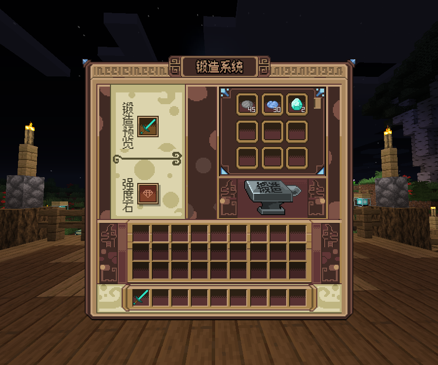

# 椰の锻造 - YeeForge

::: tip 售价
原价88R（含UI 128R），开学特惠88R，赠送配套UI。
:::

## 插件功能

- 支持 JSON / MySQL 存储 📁🔍
- 高度自定义,多配方分类,独立GUI排版
- 适配多种物品库,表达式高效计算属性数值
- 支持条件表达式及多种情况执行动作
- 可扩展锻造队列，保底，鉴定，合成，商店等功能
- 支持配方成功率，概率产出奖励，锻造材料兼容灵魂空间及离渊仓库

## 效果展示

## 原版页面

