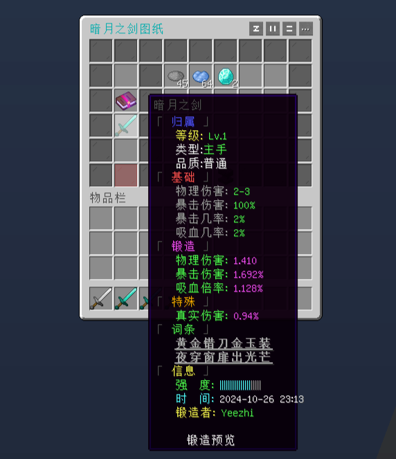
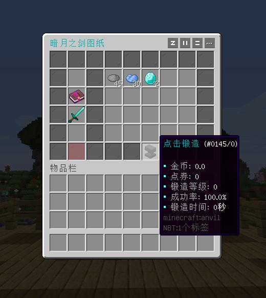
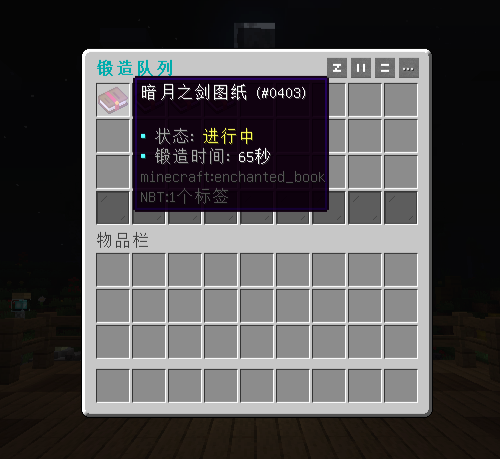
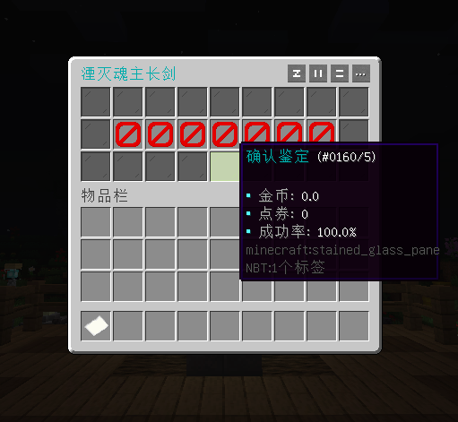
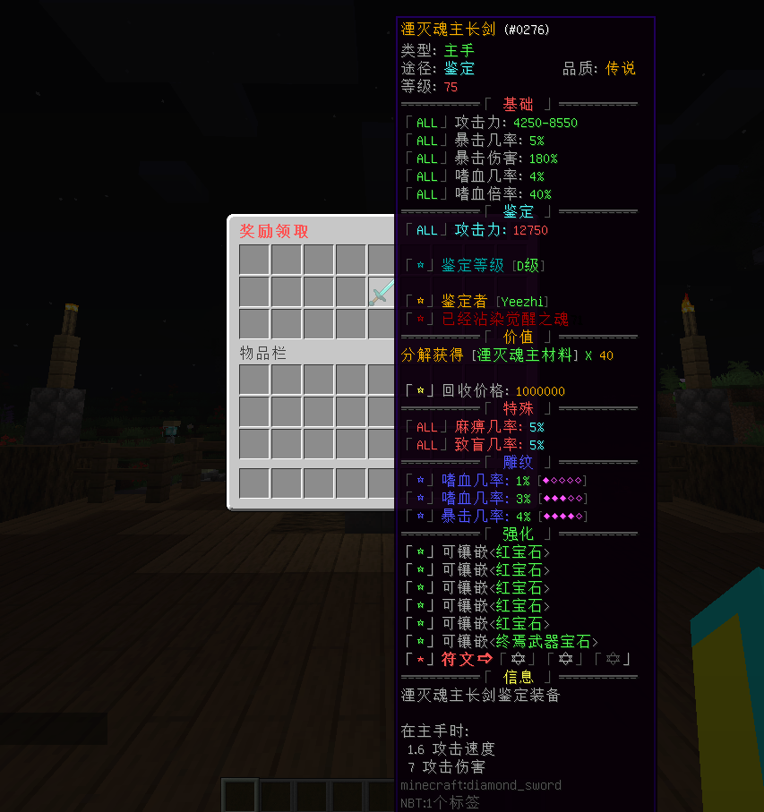
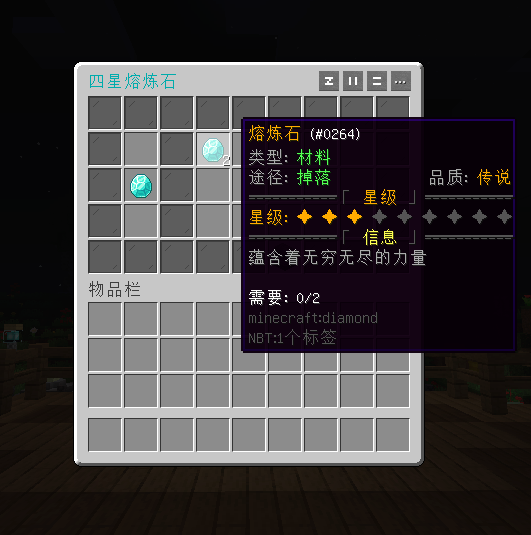

# 椰の锻造 - YeeForge - 88R

#### ℹ️适用版本

- 1.9-1.21

#### 🔧插件功能：

- 支持 JSON / MySQL 存储 📁🔍
- 适配多种物品库,高效表达式处理武器数值
- 高度自定义,多配方分类,独立GUI排版
- 可扩展锻造队列，保底，鉴定，合成，商店等功能
- 支持配方成功率，概率产出奖励，材料需求已兼容灵魂空间
- 支持YeeCore表达式，可扩展权限、自定义货币等附加条件

#### 🎉效果展示

