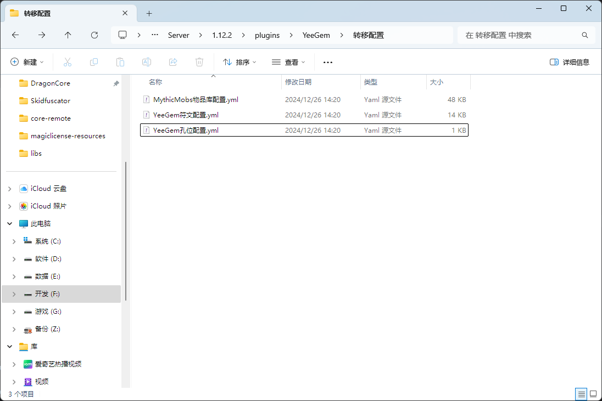

# ZF-Runes配置迁移

### **迁移须知**
- 请先在测试服验证无误并备份数据后，再进行主服操作。  
- 迁移前已镶嵌的 ZF-Runes 符文需使用原插件拆卸
- 如果符文属性写在 Lore 中，仅需迁移物品库和槽位配置，无需迁移符文配置

### **视频教学**
<iframe src="//player.bilibili.com/player.html?isOutside=true&aid=113725046523726&bvid=BV1ruCpY7EeA&cid=27563067321&p=1" scrolling="no" border="0" frameborder="no" framespacing="0" allowfullscreen="true"></iframe>

### **迁移步骤**

从 ZF-Runes 迁移至 YeeGem，请按照以下步骤操作：

1. **安装插件**  
   确保服务器已安装 **YeeGem**、**ZF-Runes** 和 **MythicMobs**。  
   如果 ZF-Runes 是经过魔改改名的版本，请将其配置文件名改成 **ZF-Runes**。

2. **配置转换**  
   使用指令 `/yeegemzf run` 一键转换配置 并查看后台转换结果。  
   如果无报错，请检查目录 `plugins\YeeGem\转移配置`，确认配置文件是否完整。
   

3. **物品库配置**  
   将 `plugins\YeeGem\转移配置\MythicMobs物品库配置.yml` 移至 `plugins\MythicMobs\Items` 文件夹。

4. **符文配置**  
   将 `plugins\YeeGem\转移配置\YeeGem符文配置.yml` 移至 `plugins\YeeGem\gem` 文件夹。

5. **孔位配置**  
   将 `plugins\YeeGem\转移配置\YeeGem孔位配置.yml` 移至 `plugins\YeeGem\slot` 文件夹，并删除默认符文孔配置。

6. **重载配置**  
   完成上述操作后，重载 YeeGem 和 MythicMobs 配置以生效。

建议再度检查配置和功能，确保一切正常运行。

