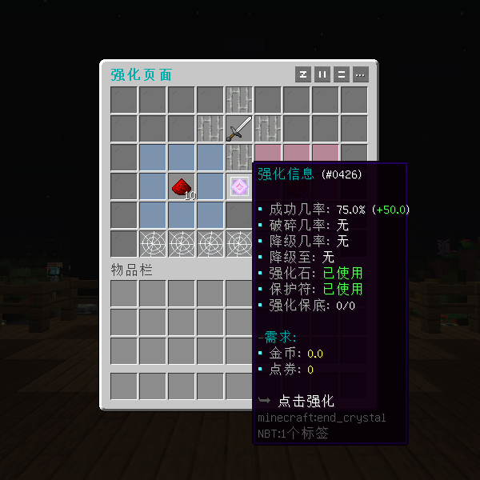
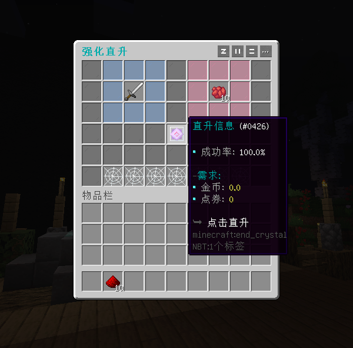
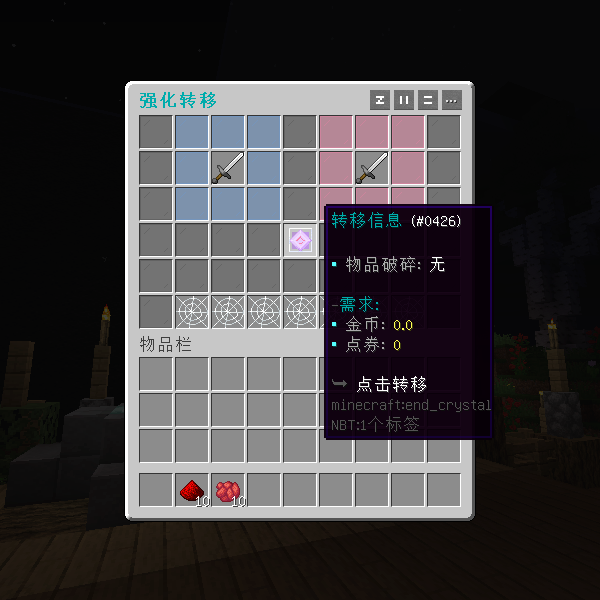
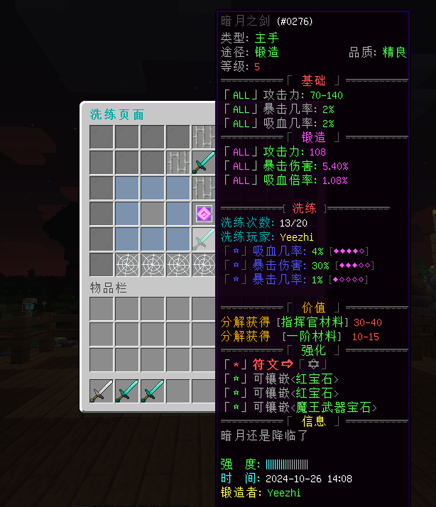

# 椰の宝石 - YeeGem - 99R

## 插件介绍

YeeGem 是一款高扩展性宝石插件，支持通过表达式区分宝石类型，提供快捷操作和高度自定义配置，简化繁琐设置。

## 插件特性

通过简单的两条参数（match 匹配宝石，slot 区分宝石孔位），即可完成所有宝石的配置，省去复杂的配置流程。

例如：通过匹配物品名包含“红宝石”，即可对所有符合条件的物品进行镶嵌和拆卸操作。

## 插件功能
- 支持从 ZF-Runes 一键迁移
- 表达式匹配宝石，多物品库支持
- 支持显示、隐藏属性及额外属性加成
- 快捷镶嵌与拆卸
- 指定孔位进行镶嵌与拆卸
- 设置孔位或宝石镶嵌数量上限
- 自定义镶嵌、拆卸所需货币或物品
- 镶嵌后增加附魔效果
- 镶嵌、拆卸保护符，提升成功率
- 提供拆卸器，未用拆卸器时可选择孔位损坏或不返还宝石
- 支持解锁、修复孔位，设置货币或物品作为修复条件
- 支持多达20余种情况执行动作
- 自定义GUI排版，指定类型孔位显示位置
- <button @click="isOpen = !isOpen" style= "font-size: 1rem">兼容热门属性插件与饰品背包  {{ isOpen ? '[点击收起]' : '[点击查看]' }}</button>

 <b>插件适配</b>   
 <ul>
    <li>✅属性 SX-Attribute</li>
    <li>✅属性 AttributePlus</li>
    <li>✅属性 ItemLoreOrigin</li>
    <li>✅属性 OriginAttribute</li>
    <li>✅饰品 YeeJewelry</li>
    <li>✅饰品 LyInventory</li>
    <li>✅饰品 LegendJewelry</li>
    <li>✅饰品 AttributeInventory</li>
  </ul>

## 更新计划

- 🚧宝石羁绊（宝石套装）
- 🚧交互类玩法（技能宝石）

## 效果展示

