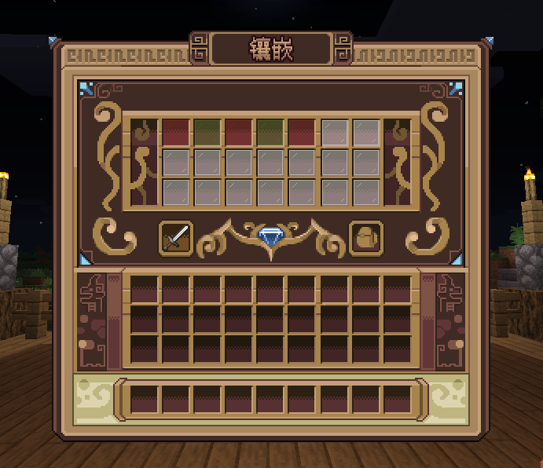

# 椰の宝石 - YeeGem

::: tip 售价
原价99R（含UI 128R），寒假特惠88R，赠送配套UI。
:::

## 插件介绍

YeeGem 是一款高扩展性的宝石插件，支持通过表达式区分宝石，提供快捷操作和高度自定义配置，简化配置流程。同时支持从 ZF-Runes 和
ItemLoreOrigin 一键迁移符文配置

## 插件特性

通过简单的两条参数（match 匹配宝石，slot 区分宝石孔位），即可完成所有宝石的配置，省去复杂的配置流程。

例如：通过匹配物品名包含“红宝石”，即可对所有符合条件的物品进行镶嵌和拆卸操作。

## 插件功能

- 支持从 ZF-Runes、ItemLoreOrigin 一键迁移符文
- 表达式匹配宝石，多物品库支持
- 支持显示、隐藏属性(符文)及额外属性加成
- 镶嵌后随机属性，可使用计算公式与表达式
- 支持宝石套装
- 快捷镶嵌与拆卸
- 指定孔位进行镶嵌与拆卸
- 宝石镶嵌数量上限，支持按等级、权限等条件设定限制
- 自定义镶嵌、拆卸所需货币或物品
- 镶嵌后增加附魔效果
- 镶嵌、拆卸保护符，提升成功率
- 提供拆卸器，未用拆卸器时可选择孔位损坏或不返还宝石
- 支持解锁、修复孔位，设置货币或物品作为修复条件
- 支持多达20余种情况执行动作
- 自定义GUI排版，指定类型孔位显示位置

兼容热门属性与槽位扩展插件，同时支持背包槽位读取 [点击展开]

- ✅属性 SX-Attribute
- ✅属性 AttributePlus
- ✅属性 ItemLoreOrigin
- ✅属性 OriginAttribute
- ✅属性 MMOItems
- ✅龙核 DragonCore
- ✅萌芽 GermPlugin
- ✅时装 DragonInventory
- ✅饰品 YeeJewelry
- ✅饰品 LyInventory
- ✅饰品 LegendJewelry
- ✅饰品 AttributeInventory

## 更新计划

- 🚧交互类玩法（技能宝石）

## 视频介绍

<iframe src="//player.bilibili.com/player.html?isOutside=true&aid=113740062197230&bvid=BV1Hr6uYMEPf&cid=27563067321&p=1" scrolling="no" border="0" frameborder="no" framespacing="0" allowfullscreen="true"></iframe>

## 效果展示

