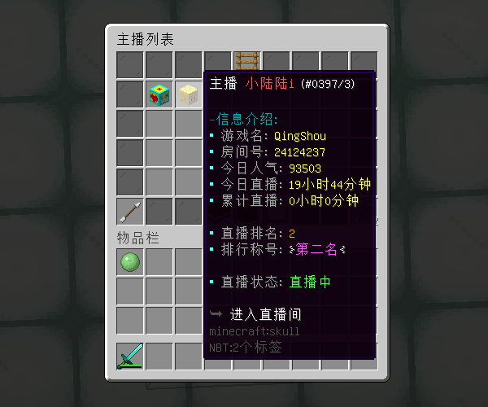

# 虎牙奖励 - YeeHuya - 88R

#### ℹ️适用版本

- 1.9-1.20

#### 🔧插件功能：

- 支持 JSON / MySQL 存储 📁
- 📈根据主播累计直播时长进行排名，排行周期结束自动清除时长统计。
- 🏆排名结果可显示主播的名称、房间号、直播时长、最高人气、直播状态等信息。
- 🎁主播直播达到设定的要求（如直播时长、直播人气、排行名次等）后，可领取相应奖励或增幅属性。
- 📝支持YeeCore表达式配置排行榜的奖励和增幅属性，配置更灵活
- 🔄支持查看历史排行榜的所有排名信息，以及领取历史排行榜的奖励
- 📚属性支持 SX-Attribute , AttributePlus , 和ItemLoreOrigin

#### 🎬使用视频：

[YeeHuya 使用视频](https://www.bilibili.com/video/BV1x1421C7YJ/?share_source=copy_web&vd_source=92b2fd908671149c91aa9aa2d1163754)

#### 🎉效果展示

#### 📅直播签到：

#### 🎁直播奖励：

#### 🔄历史排行榜：

#### 📚排行榜属性：

