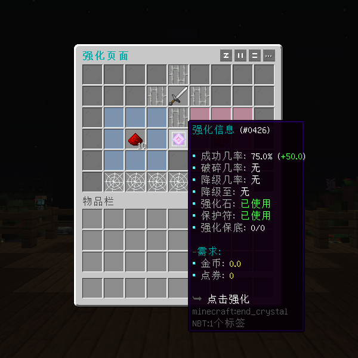
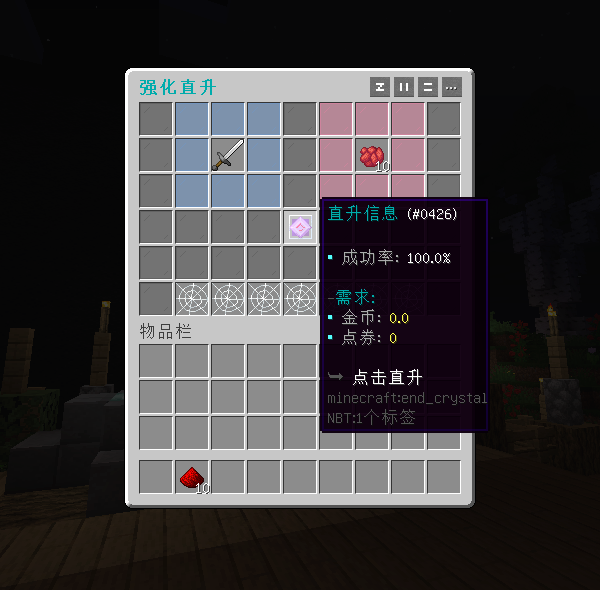
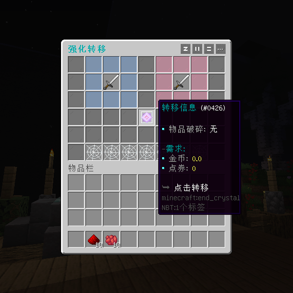
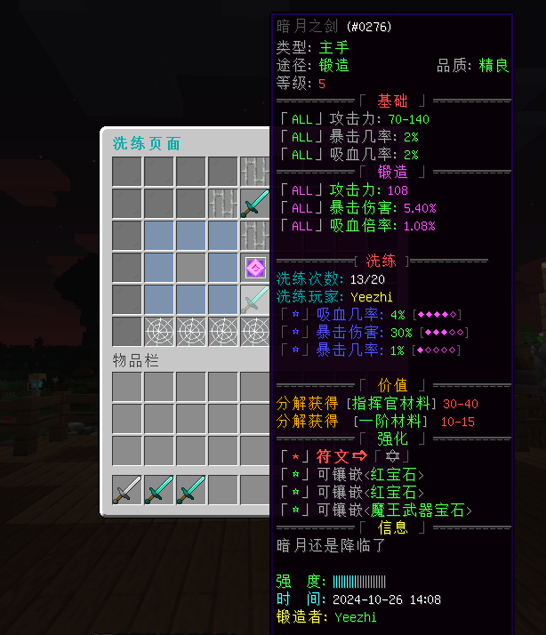

# 椰の强化 - YeeIntensify - 88R
#### 还在为传统强化插件的单调或繁琐的配置烦恼吗
#### 🔧基础功能
- 支持为每个GUI独立设置强化方案，实现不同的功能
- 强化材料支持多种物品库，同时还可以从灵魂空间中直接扣除。
- 提供强化预览、强化保底、强化转移与强化直升功能，满足不同的玩法需求。
- 可通过条件表达式限制强化配方，强化成功或失败均可执行不同的动作。
- 针对装备破碎、降级、触发保底、使用保护符等情况，均可灵活配置不同的动作表达式。
#### 🔍进阶功能(不限于)
- ✅无限强化
- ✅洗练与鉴定
- ✅属性随机数值
- ✅保底次数增加成功率
- ✅满足不同权限或其它需求生效不同的成功率
- ✅通过变量或表达式计算强化属性，成功率等
#### 🎉效果展示

