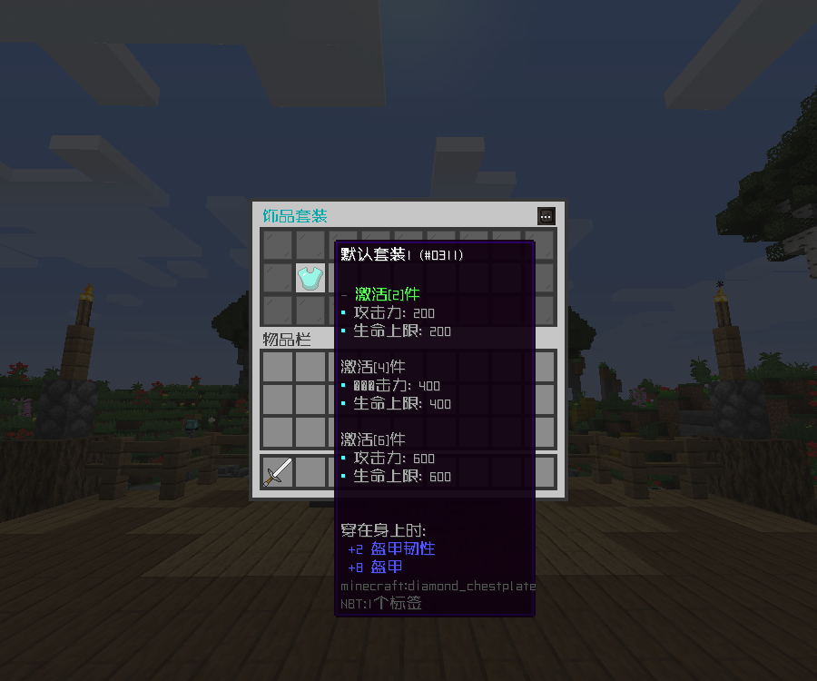

# 饰品背包 - YeeJewelry - 77R

### YeeCore赋能，超高扩展性颠覆传统饰品背包

#### ℹ️适用版本

- 1.9-1.20

#### 🔧插件功能：

- 支持 JSON / MySQL 存储 📁🔍
- 支持创建多饰品页，同时生效多饰品套装
- 支持 Shift 快捷 放置/取出 饰品
- 支持槽位解锁的条件/动作，槽位 放置/取出 的 条件/动作
- 超强GUI自定义性,可任意修改排版和按钮执行的条件/动作
- 属性支持 SX-Attribute , AttributePlus , 和ItemLoreOrigin

#### 🌟插件适配：

- ✅属性 AttributePlus
- ✅属性 SX-Attribute
- ✅属性 ItemLoreOrigin
- ✅属性 OriginAttribute
- ✅宝石 SpecialAttributes
- ✅宝石 Legendinlay
- ✅符文 ZF-Runes
- ✅时装 DragonArmourers

#### 🎉效果展示

