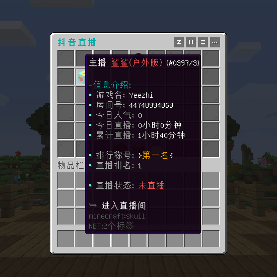
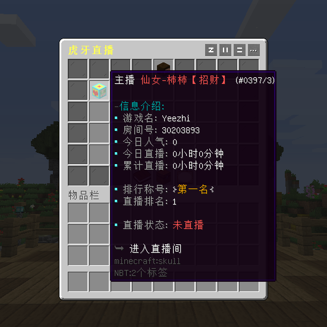
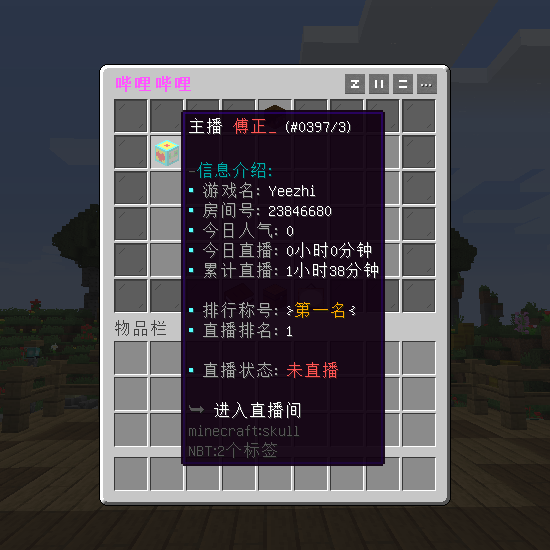
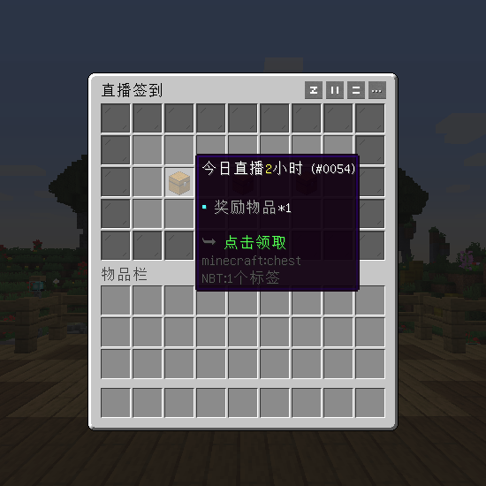
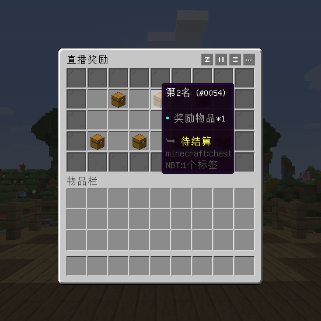
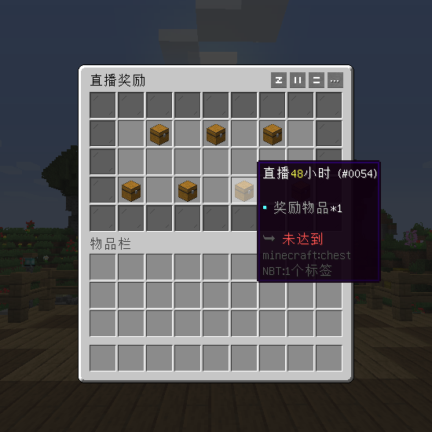
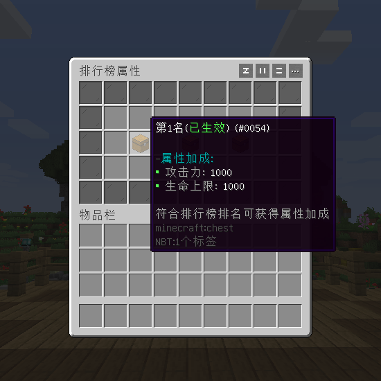
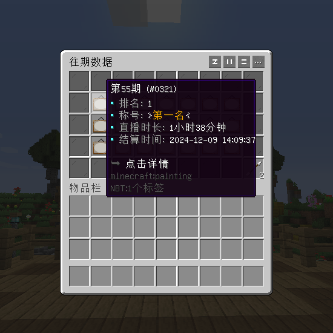

# 直播奖励 - YeeLive - 128R

#### ℹ️适用版本

- 1.9-1.21

#### 🔧插件功能：

- 📁支持 SQLite / MySQL 存储
- 📺直播平台： `虎牙直播`、`哔哩哔哩`、`抖音直播`
- 📈根据主播累计直播时长进行排名，及排行榜自动结算。
- 🏆排名信息可显示主播的名称、房间号、直播时长、最高人气、直播状态等信息。
- 🎁直播达到要求（如直播时长、直播人气、排行名次等）后，可领取相应奖励或属性增幅。
- 📝支持YeeCore表达式配置排行榜的奖励和增幅属性，配置更灵活
- 🔄支持查看历史排行榜的所有排名信息，以及领取历史排行榜的奖励
- 📚属性支持 SX-Attribute , AttributePlus , 和ItemLoreOrigin

#### 🎬使用视频：

[YeeLive 使用视频](https://www.bilibili.com/video/BV1x1421C7YJ/?share_source=copy_web&vd_source=92b2fd908671149c91aa9aa2d1163754)

#### 🎉效果展示

#### 📅主播签到

#### 🎁直播奖励

#### 📚排名属性

#### 🔄历史排行

