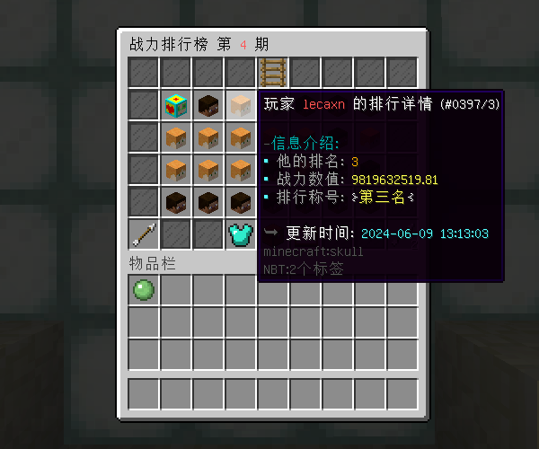

# 排行榜 - YeeRank - 77R

有了Placeholder变量，万物皆可排行！

#### ℹ️适用版本

- 1.9-1.20

#### 🔧插件功能：

- 支持 JSON / MySQL 存储 📁
- 支持创建和管理多个排行榜 🏆
- 排行榜根据自定义变量的数值进行排序，灵活适应不同需求和玩法 🔢
- 支持查看历史排行榜的所有排名信息，以及领取历史排行榜的奖励 📊
- 支持YeeCore表达式配置排行榜的奖励和增幅属性，配置更灵活 📝
- 支持排行榜周期自动结束，确保排行榜按时更新和重置⏰
- 可利用变量实现战力排行💪，货币排行💰， 累充排行💳 等各种排行
- 属性支持 SX-Attribute , AttributePlus , 和ItemLoreOrigin 📚

#### 🎉效果展示

#### 历史排行榜：

#### 排行榜奖励：

#### 排行榜属性：

#### 🎬使用视频

[YeeRank 使用视频_哔哩哔哩bilibili_我的世界_演示](https://www.bilibili.com/video/BV1Ss421u7nE/?t=30.095345&spm_id_from=333.1350.jump_directly)
