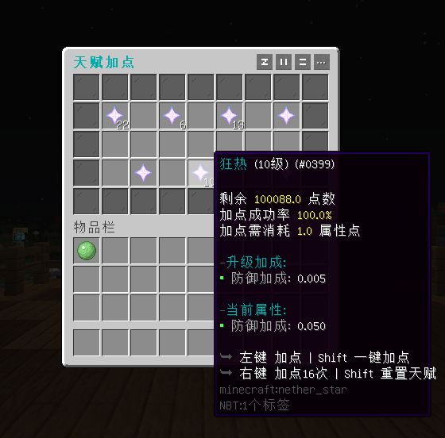
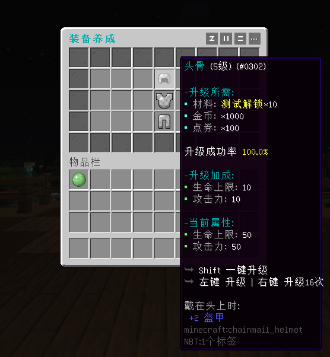

# 天赋加点 - YeeTalent - 77R

#### ℹ️适用版本

- 1.9-1.20

#### 🔧插件功能：

- 支持 JSON / MySQL 存储 📁🔍
- 玩家可以通过加点天赋获得各种增幅属性
- 支持一键加点以及可配置点数返回倍率的天赋重置
- 涉及数值的参数均支持使用PAPI变量和GUI占位符进行计算
- 支持使用条件表达式根据等级阶段新增不同属性，甚至实现天赋树等多样化玩法。
- 支持配置多个天赋页及独立点数，可通过表达式创造更多的玩法，例如装备养成
- 属性支持 SX-Attribute , AttributePlus , ItemLoreOrigin和OriginAttribute

#### 🎉效果展示

