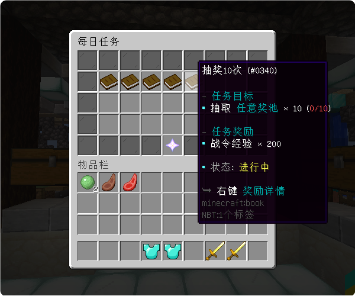
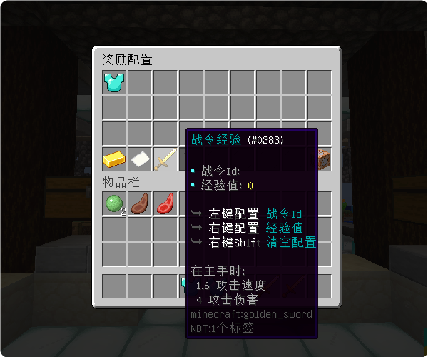
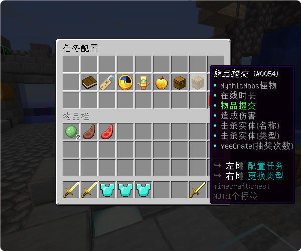

# 日常任务 - YeeTask - 88R

#### ℹ️适用版本

- 1.9-1.20

#### 🔧插件功能：

- 支持 JSON / MySQL 存储 📁🔍
- 任务周期 每日任务⏰，每周任务📅，每月任务🌙
- 自定义任务随机数量🔢，随机权重🎲，权限需求🔑
- 已作为 YeeBattlePass(战令)指定任务系统🎯
- 强大的插件生态，目前正在持续适配自家插件的任务类型🌱
- 任务配置简单，任务配置100%由GUI操作，不需要修改一行配置文件🛠️

#### 🌟奖励类型：

- ✅自定义指令
- ✅Vault 货币
- ✅PlayerPoints 货币
- ✅YeeBattlePass 经验值

#### 📜任务类型：

- ✅Placeholder 条件判断
- ✅抽奖次数 (YeeCrate)
- ✅击杀实体(MythicMobs)
- ✅累计伤害(MythicMobs)
- ✅击杀实体(类型)
- ✅击杀实体(名称)
- ✅在线时长
- ✅提交物品
- ✅方块挖掘

#### 🎉效果展示

